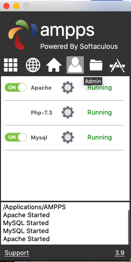
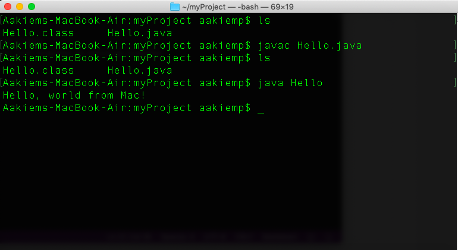
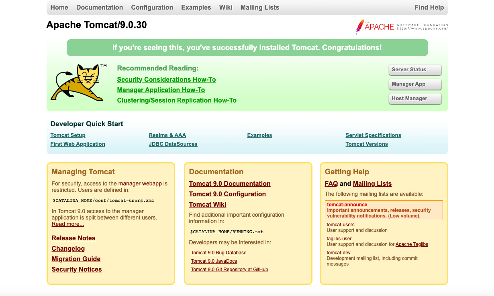

## Aakiem Philippe

### Assignment #1 Requirements:
1. Distributed version control with Git and Bitbucket
2. development installations
3. questions

# README.md file should include the following items:
- screenshots of running java Hello
- sreenshot of running http//
- git commands w/short descriptions
- bitbucket repo links

### Git commands w/shrt descriptions
1. git init - creates new repository
2. git status - displays the current state
3. git add - adds all modified and new files
4. git commit - individual change to a file
5. git push - used to upload local repo
6. git pull - used to update the local version of a repo
7. git push origin master - push changes from all lcal branches to matching branches

#### Assignment Screenshots:

*Screenshot code and output*:

*Screenshot of a1 code and output*:

*Screenshot of a1 code and output*:

#### Tutorial Links:

*Link to Local Host:*
[Local Host Link](http://localhost:9999/lis4368/ "Link to Local Host")

*Bitbucket Tutorial - Station Locations:*
[A1 Bitbucket Station Locations Tutorial Link](https://bitbucket.org/asp16f/bitbucketstationlocations/ "Bitbucket Station Locations")

*Tutorial: Request to update a teammate's repository:*
[A1 My Team Quotes Tutorial Link](https://bitbucket.org/asp16f/myteamquotes/ "My Team Quotes Tutorial")
