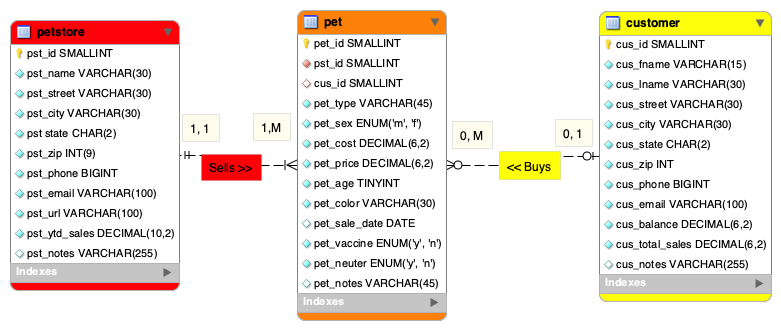

## Aakiem Philippe

### Assignment #3 Requirements:
1. Entity Relationship Diagram (ERD)
2. Include data (at least 10 records each table) 
3. Provide Bitbucket read-only access to lis4368 repo (Language SQL) must include README.md using Markdown syntax, and include links to all of the following files (from README.md):
    - docs folder: a3.mwb amd a3.sql
    - img folder: a3.png 
    - README.md (must display a3.png)

#### Assignment Screenshots and links:

*Screenshot A3 ERD:*

*A3 docs: a3.mwb and a3.sql:*

[A3 MWB File](docs/a3.mwb "A3 ERD in .mwb format")

[A3 SQL Script](docs/a3.sql "A3 SQL Script")