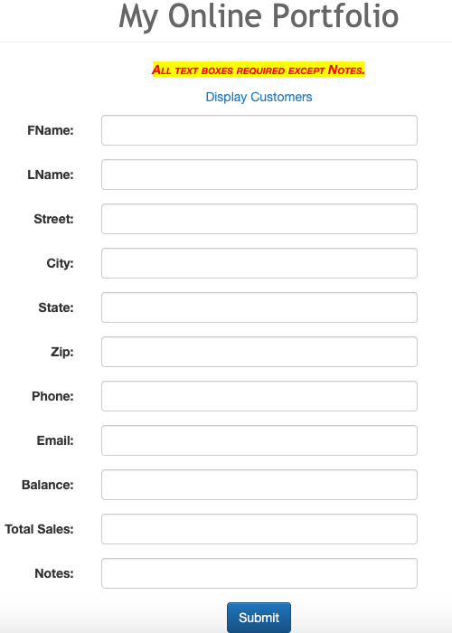
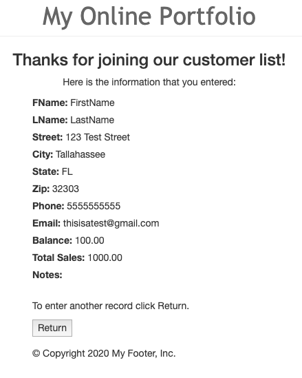

# LIS4368

## Aakiem Philippe

### Assignment #4 Requirements:

*Deliverables:*

1. Show Server-Side Validation
2. Work with JSP Forms
3. Provide Bitbucket read-only acces to cdy15 repo

#### README.md file should include the following items:

- Screenshot of A4 Correct Validation
- Screenshot of A4 Failed Validation

#### Assignment Screenshot and Links:

*Screentshot of A4 Failed Validation*:

*Screenshot of A4 Correct Validation*:

#### Links:

*Bitbucket Repo:*
<https://bitbucket.org/asp16f/lis4368>

*My Web Portfolio*:
<http://localhost:9999/lis4368/index.jsp>
