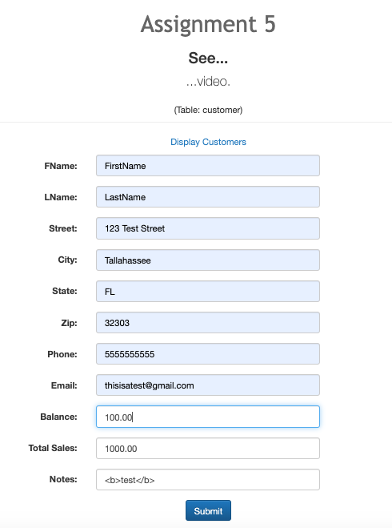
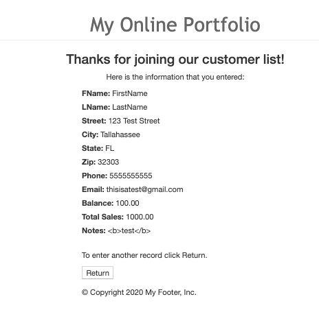
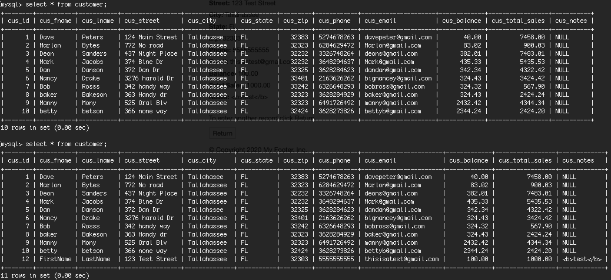

# LIS4368

## Aakiem Philippe

### Assignment #5:

*Deliverables:*

1. Show Server-Side Validation
2. Provide Screenshot to inserted data
3. Provide Bitbucket read-only acces to cdy15 repo

#### README.md file should include the following items:

- Screenshot of Valid User Form Entry
- Screenshot of Passed Validation
- Screenshot of Associated Database Entry

#### Assignment Screenshot and Links:

| *Screentshot of Valid User Form Entry*:        | *Screenshot of Passed Validation*:           | 
| ------------- |:-------------:| 
|       |  |

*Screenshot of Associated Database Entry*:

#### Links:

*Bitbucket Repo:*
<https://bitbucket.org/asp16f/lis4368>

*My Web Portfolio*:
<http://localhost:9999/lis4368/index.jsp>