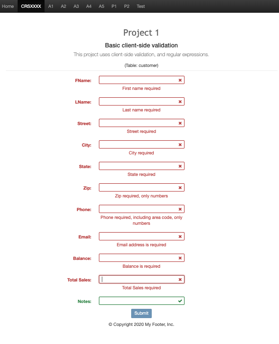
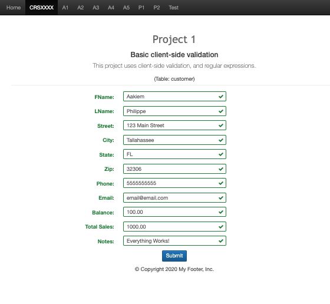

# LIS4368

## Aakiem Philippe

### Project #1 Requirements:

*Deliverables:*

1. Desing a web application that validates data with regular expressions

#### README.md file should include the following items:

- Screenshot of P1 Failed Validation
- Screenshot of P1 Successful Validation

#### Project Screenshot and Links:

*Screenshot of Failed Validation*:

*Screenshot of Successful Validation*:

#### Links:

*Link to P1*:
<http://localhost:9999/lis4368/p1/index.jsp>

