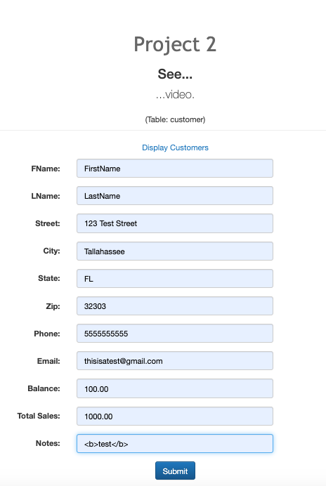
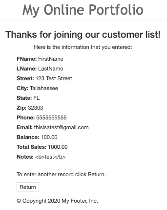
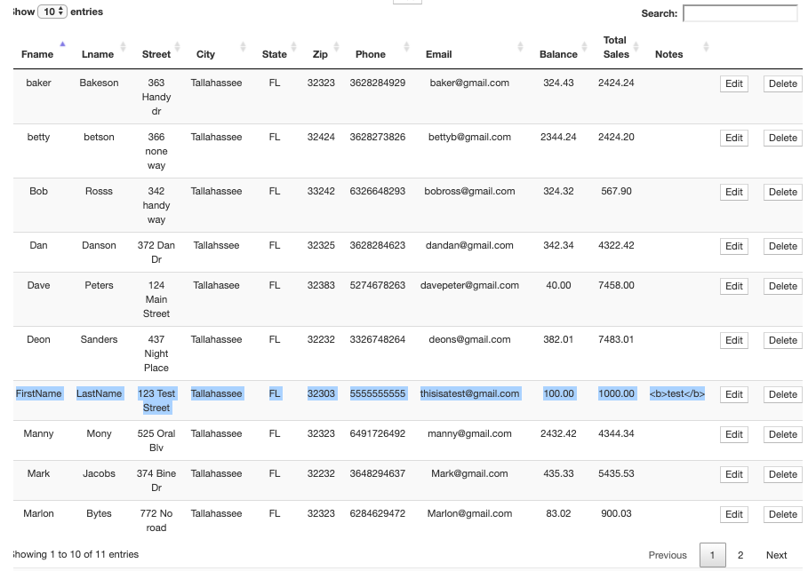
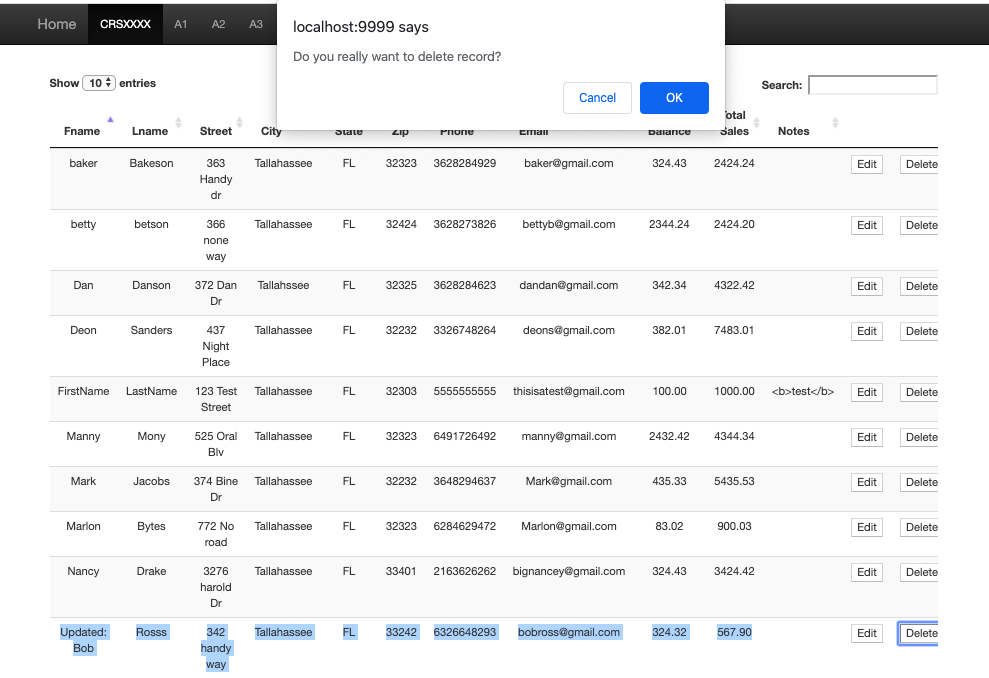
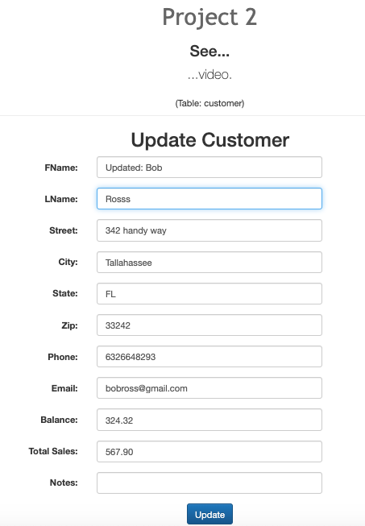
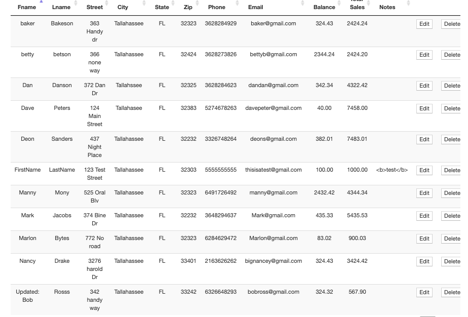
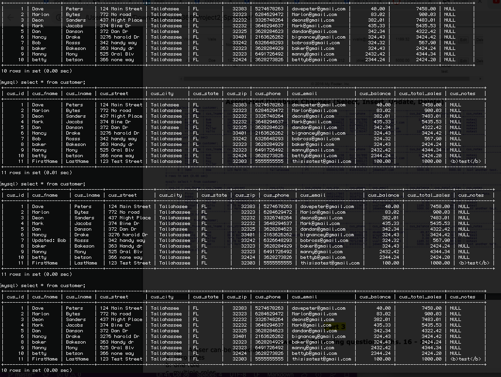

# LIS4368

## Aakiem Philippe

### Project #2 Requirements:

*Deliverables:*

1. Desing a web application that uses CRUD functionality
2. Be able to display list of customers in application

#### README.md file should include the following items:

- Screenshot of valid user form
- Screenshot of passed validation
- Screenshot of displayed data
- Screenshot of modified data
- Screenshot of delete warning
- Screenshot of associated changes

#### Project Screenshot and Links:

 

| *Screentshot of Valid User Form Entry*:        | *Screenshot of Passed Validation*:           | 
| ------------- |:-------------:| 
|       |  |

| *Screentshot of Displayed Data*:        | *Screenshot of Deletion Warning*:           | 
| ------------- |:-------------:| 
|       |  |

| *Screentshot of Data Being Modified*:        | *Screenshot of Modified Data*:           | 
| ------------- |:-------------:| 
|       |  |

*Screenshot of Associated Changes*

#### Links:

*Web Portfolio for P2*:
<http://localhost:9999/lis4368/>